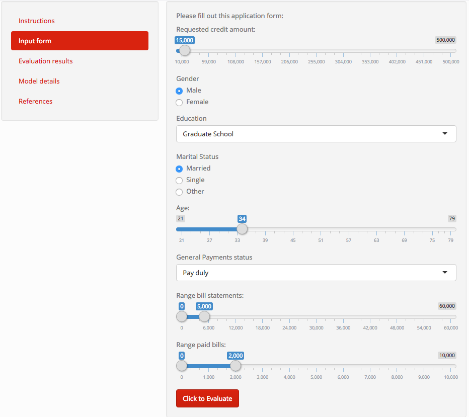

```{r setup, include=FALSE}
knitr::opts_chunk$set(echo = FALSE)
```

<script src="https://ajax.googleapis.com/ajax/libs/jquery/1.12.2/jquery.min.js"></script>

<script>
    $(document).ready(function() {
      $('slide:not(.title-slide, .backdrop, .segue)').append('<footer label=\"Written by Elmer Ore\"></footer>');    
    })
</script>


## Credit score demo {.contents}

I built an application to demonstrate the use of Machine learning and Shinny apps.
It is about a credit application.  

Some of the data used in the model:

```{r echo = FALSE, message=FALSE, warning=FALSE, out.width="75%", out.height="75%"}
library(ggplot2)

load(file = "data/press.rda")

ggplot( data=press, aes(MARRIAGE, LIMIT_BAL)) +
          geom_boxplot(varwidth = TRUE, fill = "white", colour = "blue", outlier.alpha = 0.1 ) +
  ggtitle("Distribution of credit by marital status") + 
  xlab("Marital status") +
  ylab("Credit amount")

```


## How to use the application {.contents}
{#id .class width=85% height=85%}


## Form to complete the evaluation {.contents}
{#id .class width=85% height=85%}

## Result examples {.contents}
{#id .class width=100% height=100%}
{#id .class width=100% height=100%}
