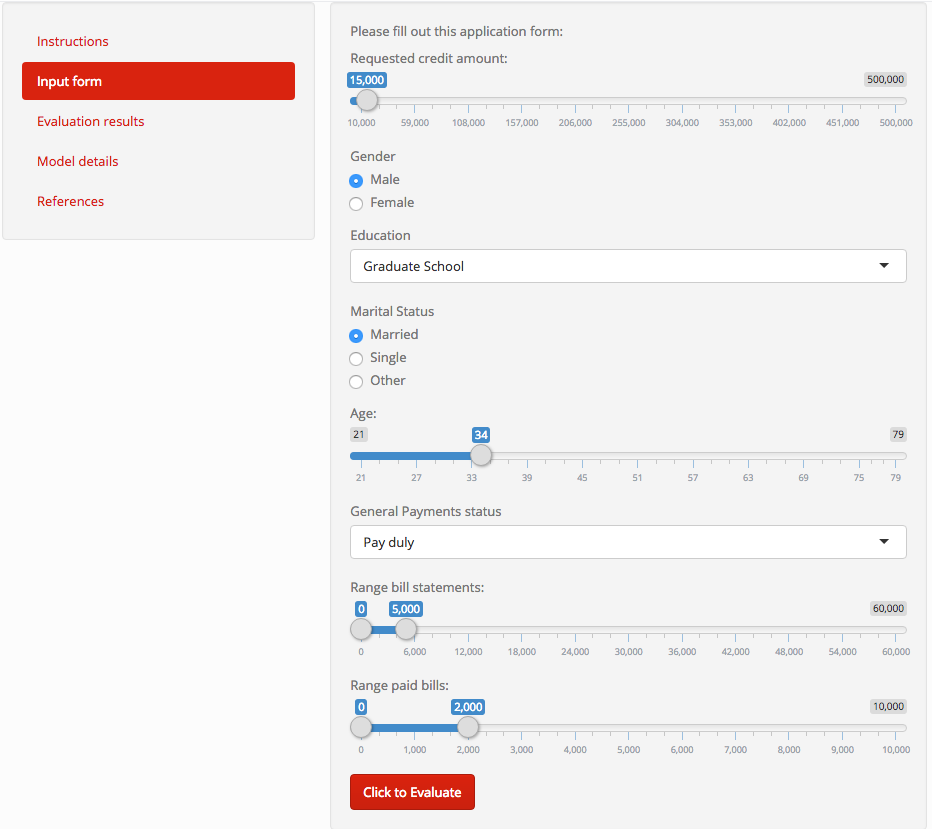
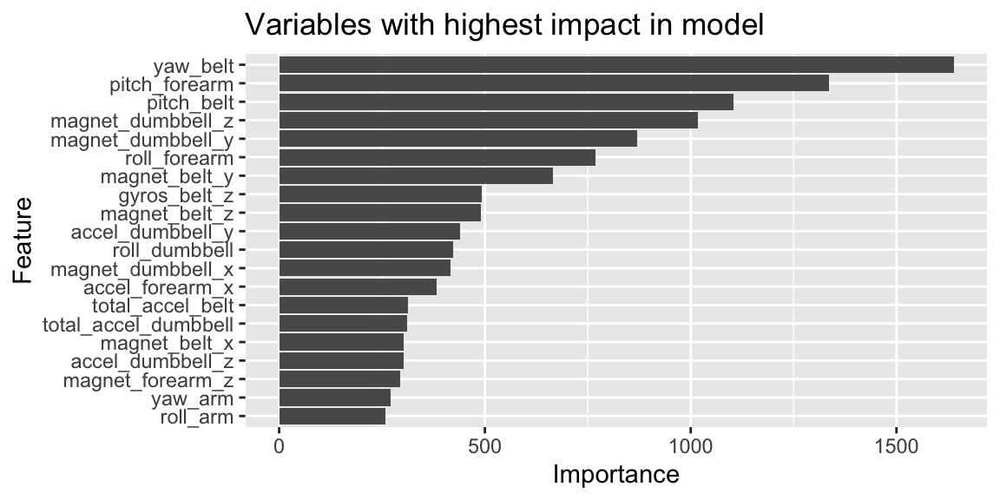
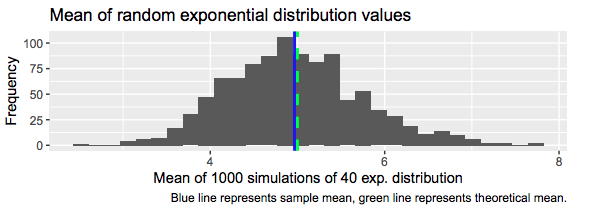
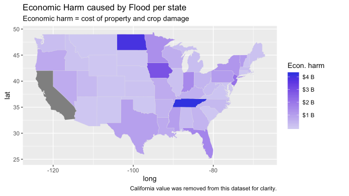
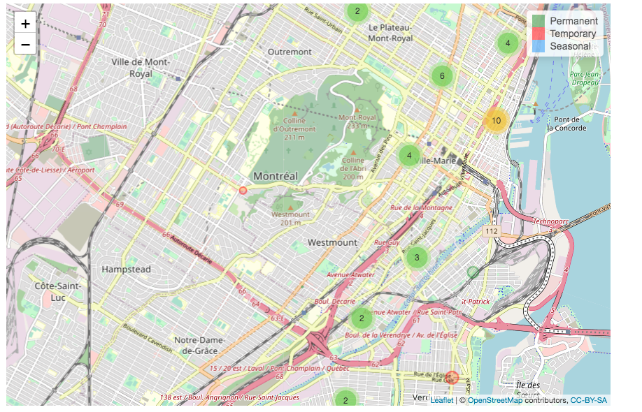
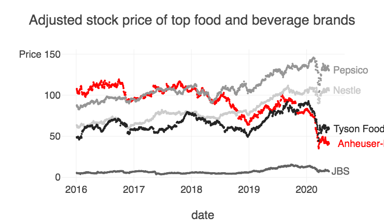
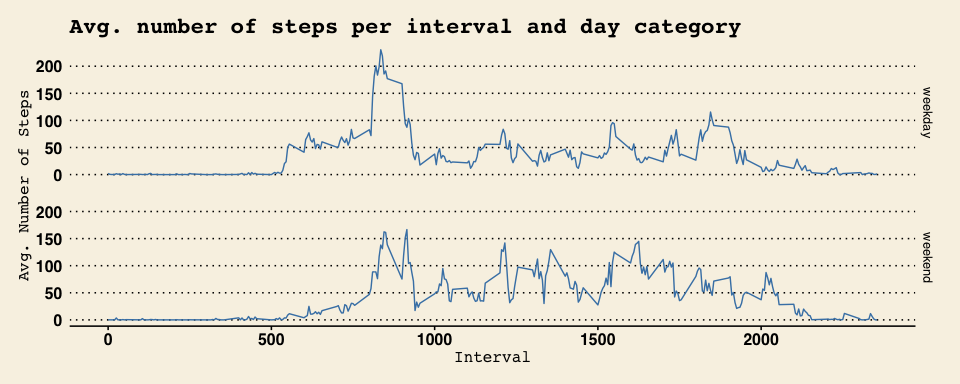

Some of the analysis and projects I worked on. 

### Modelling

1. Prediction Modeling demo: Predict the worthiness of credit applicants in a financial institution.  [Link to the presentation](https://eorep.github.io/showcases/credit_score_presentation.html), and the [Shiny application](https://eore.shinyapps.io/credit_score_demo/).  Models tested: Generalized linear model, random forest and neural networks. Using: **caret, recipes, ggplot2, dplyr, readxl, parallel, doParallel, shiny and shinythemes**.  
{#id .class width=50% height=50%}
1. Prediction modeling: [predict the effectiveness of weight lifting](https://eorep.github.io/practicalmachinelearning/) using data from accelerometers. Model used: Random Forest. Using: **dplyr, recipes, caret and parallel packages**.
    
    {#id .class width=50% height=50%}
1. Regression analysis [comparing manual and automatic transmission over MPG performance](https://coursera-assessments.s3.amazonaws.com/assessments/1571708835934/97dd0ef7-d870-4ad2-ea56-8ca08278302e/Regression-models-project.pdf).  Using **Akaike Information Criterion (AIC), Analysis of Variance (ANOVA) methods and Shapiro-Wilk test**. 

### Statistics

1. Hypothesis testing: adding statistical significance and confidence intervals to multiple A/B tests.  Using: **BigQuery, R and PowerBI**.
    
1. Statistical inference, describing the [exponential distribution and its relationship with the Central Limit Theorem](https://coursera-assessments.s3.amazonaws.com/assessments/1564248532650/aa651d9e-14b0-40d6-adf4-5b8da5679d0b/Inference-project-1-simulation.pdf).
    {#id .class width=80% height=80%}
2. Hypothesis testing, [inferential analysis using the ToothGrowth dataset](https://coursera-assessments.s3.amazonaws.com/assessments/1564248549650/c70af9b2-8a97-4aaa-c4f0-d04912a80c53/Inference-project-2-inferential-analysis.pdf).

### Data Analysis

1. Descriptive analysis of the storms recorded by the U.S. National Oceanic and Atmospheric Administration’s (NOAA) from 1950 to 2011. Tools: **dplyr, ggplot2, maps**.  [Report and source code of the analysis done.](https://rpubs.com/eore/coursera-reproducible-research-project2)
    {#id .class width=80% height=80%}
1. Locations where [pedestrians can walk on the streets of Montreal](https://eorep.github.io/showcases/montreal_pedestrian_streets.html) with an interactive map using **Leaflet**. Using open dataset from the city of Montreal.

    {#id .class width=50% height=50%}

### Visualization
1. Introductory [stock analysis for Top Food & Beverage companies](https://eorep.github.io/showcases/stock_analytics_food_companies.html) using **R Markdown and Plotly**.
    {#id .class width=50% height=50%}

### Others

1. Data manipulation and visualization of a [personal activity monitoring device](https://github.com/eorep/RepData_PeerAssessment1/blob/master/PA1_template.md), using **dplyr and ggplot2**.
    {#id .class width=50% height=50%}

